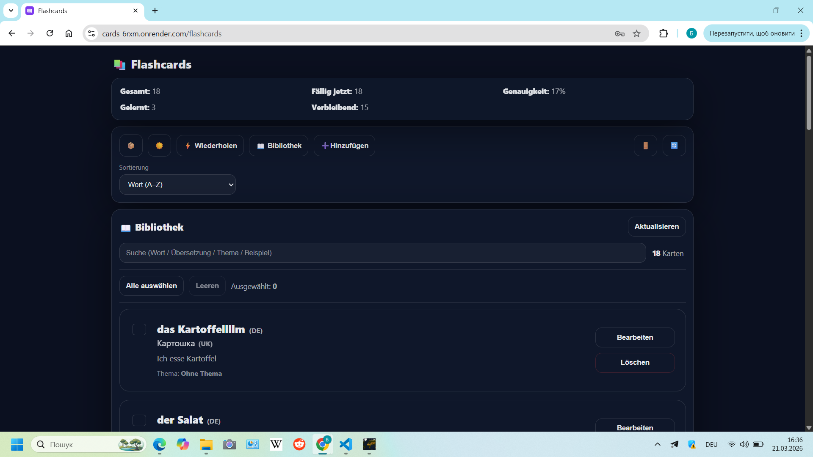
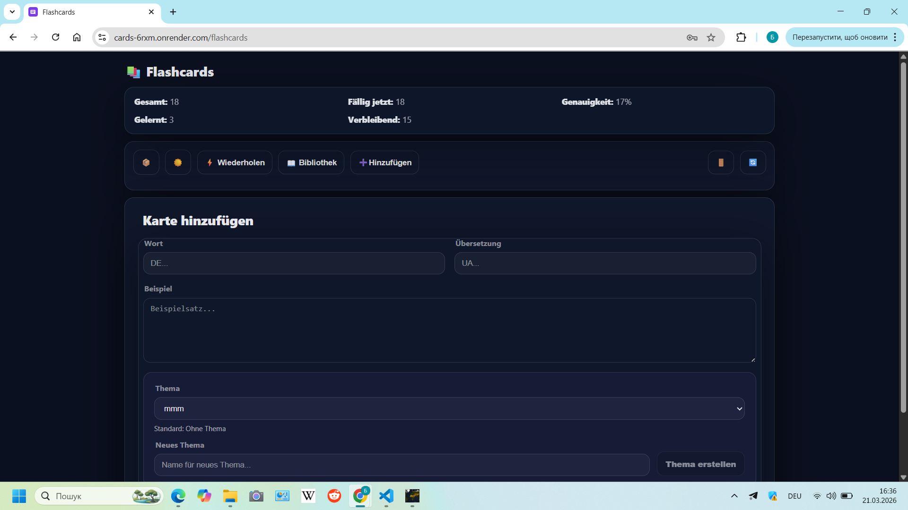

# Flashcards App — Spaced Repetition Learning System

A full-stack flashcards web application designed for efficient vocabulary learning using an interval-based spaced repetition algorithm.

The system automatically schedules card reviews based on user performance and stores the next review timestamp for each card in the database.

This project demonstrates:
- full-stack architecture
- REST API design
- JWT authentication
- interval scheduling logic
- deck-based content management
- multilingual UI

---

## Live Demo

Frontend: https://cards-6rxm.onrender.com
Backend API: https://cards-api-a10o.onrender.com

Demo account:  
- Email: demo@demo.com  
- Password: demo12345  

---

## Features

- JWT Authentication
- Deterministic spaced repetition algorithm
- Deck (Topic) management
- Bulk actions (move / delete cards)
- Multi-language UI (DE / EN / UK)
- Dark / Light mode
- Learning statistics
- Next review time preview in Library
- Import / Export (JSON / CSV)

---

## Spaced Repetition Logic

Each card follows a fixed review interval ladder:

currentTime >= nextReview

---

## Tech Stack

### Frontend
- React (Vite) — UI rendering
- React Router — navigation
- Custom CSS — styling & theming

### Backend
- Node.js — runtime
- Express — REST API
- MongoDB (Mongoose) — persistence layer
- JWT — authentication & protected routes

### Architecture
- Token-based authentication
- RESTful API
- Interval-based scheduling system
- Deck-based content grouping

---

## Screenshots

### Review Mode

### Library

### Deck Manager

---

## 🎥 Demo Video

<iframe 
  src="https://drive.google.com/file/d/1iW5fRu7CO8XUP_WU_odWtqQv_4WRE938/preview" 
  width="100%" 
  height="480" 
  allow="autoplay">
</iframe>

---

## Project Structure
/client → React frontend
/server → Express backend
---

## Author

Bohdan  
Junior Full-Stack Developer

GitHub: https://github.com/BogdanBedrinec